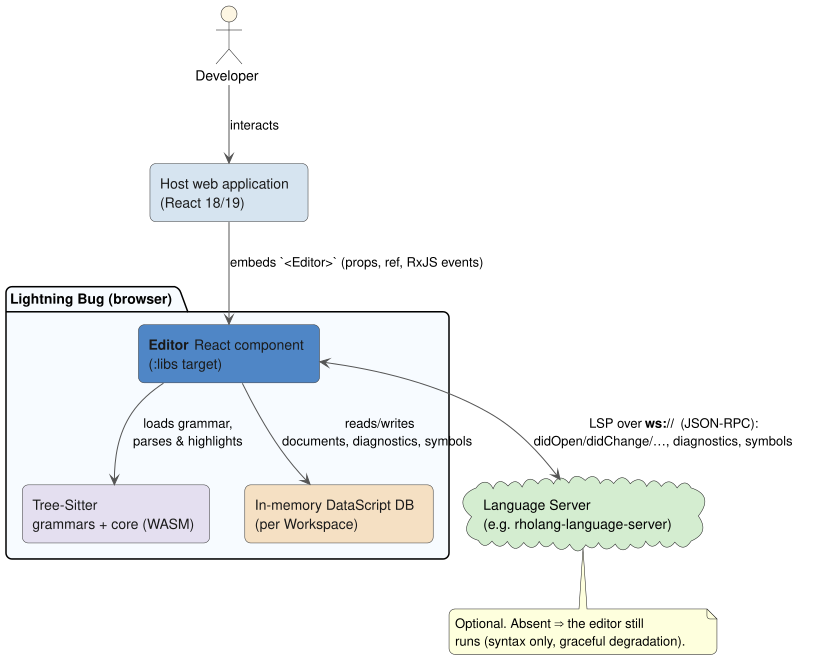

# Architecture Overview

This section documents **how Lightning Bug is built** — its layers, subsystems, and the design
decisions behind them. It describes the system as it is at version `0.7.7`. If you only want to *use*
the editor, start with the [Usage Guide](../guide/README.md) instead.

## What Lightning Bug is

Lightning Bug is an embeddable browser code editor delivered as a React component. Its pieces:

- **CodeMirror 6** — the underlying text-editing engine (document model, view, decorations,
  extensions). See [codemirror.net](https://codemirror.net/).
- **Tree-Sitter** — an incremental parsing library compiled to **WebAssembly (WASM)**; it powers
  syntax highlighting and indentation from per-language grammars. See
  [tree-sitter.github.io](https://tree-sitter.github.io/tree-sitter/).
- **Language Server Protocol (LSP)** — an optional JSON-RPC protocol, spoken here over a WebSocket,
  that supplies diagnostics and document symbols. See the
  [LSP specification](https://microsoft.github.io/language-server-protocol/).
- **DataScript** — an immutable, in-memory Datalog database for ClojureScript that holds editor
  state (open documents, diagnostics, symbols, logs, projects). See
  [github.com/tonsky/datascript](https://github.com/tonsky/datascript).
- **RxJS** — reactive event streams used to surface editor activity to the host application. See
  [rxjs.dev](https://rxjs.dev/).

### Build targets

The codebase compiles (via [shadow-cljs](https://github.com/thheller/shadow-cljs)) to several
targets. Understanding them clarifies what is *product* and what is *demonstration*:

| Target | What it is |
|--------|-----------|
| **`:libs`** | The shippable library — the `Editor` component (`lib.core`), the language extensions (`ext.lang.rholang`), and the embedded Tree-Sitter core. This is what is published to npm as `@f1r3fly-io/lightning-bug`. |
| **`:app`** | A full **demo application** built with re-frame + re-posh + reagent: a multi-file workspace UI, a logs panel, search/rename modals. It is *also the composition root* that wires the domain ports to their infrastructure adapters — so it demonstrates the intended dependency-injection seam, not merely the UI. |
| **`:demo`** | A minimal standalone HTML file that embeds `<Editor>` with no build server — the smallest possible integration. |
| **`:test`** | The browser test suite (unit, integration, property-based, multi-pane). |
| **`:benchmark`** | The performance-measurement harness (see [Benchmarks](../benchmarks/README.md)). |

## System context

At runtime a host web application embeds the `<Editor>` component, which drives CodeMirror, loads
Tree-Sitter grammars, keeps editor state in a per-Workspace DataScript database, and — when
configured — talks to a language server over a WebSocket. The language server is optional: without
it, the editor still provides syntax highlighting and editing and degrades gracefully.

## Layering and the module map

Lightning Bug is organized as a **partial hexagonal (ports-and-adapters) architecture**. The word
*partial* is important and is explained below — it is a deliberate, documented stance, not an
oversight.

- **Ports** live in `domain.protocols` — a set of ClojureScript protocols (interfaces) with no
  implementations, defining what the system can *do* to documents, diagnostics, symbols, logs,
  language servers, resources, and debouncing.
- **Adapters** live in `infrastructure.datascript-adapter` — records that implement the repository
  ports over the `lib.db` DataScript database. Each adapter record holds a Workspace's `conn`
  (database connection), so adapters are Workspace-scoped rather than global.
- The **demo application** (`app.*`) consumes the ports through re-frame **coeffects** (`app.cofx`,
  reads) and **effects** (`app.fx`, writes), with `app.system` acting as the dependency-injection
  container that instantiates the adapters. This is the seam that makes the app testable: tests
  inject mock repositories via `app.system/set-system!`.
- The **library editor** (`lib.*`) is a *parallel stack* that the app embeds. It mostly calls
  `lib.db` directly (threading the `conn`), and it consumes only **one** port polymorphically — the
  `ILspClient` (implemented by `lib.lsp.connection-manager/ConnectionManager`) — plus, internally,
  `IResourceLifecycle` and `IDebounceCoordinator`.

### Why *partial* hexagonal?

A fully hexagonal design would route every interaction — including the editor's own reads and writes
— through the domain ports. Lightning Bug deliberately does not:

- The **app** genuinely benefits from the ports: dependency injection gives it test seams and keeps
  re-frame handlers decoupled from DataScript specifics.
- The **library editor** is performance-sensitive (the keystroke path — see
  [syntax & editing](syntax-and-editing.md) and the [performance model](../benchmarks/performance-model.md))
  and already parameterized by the Workspace `conn`. Interposing a protocol on every hot-path read
  would add dispatch cost for no testability gain, because the editor's collaborators are already
  injected as plain values.

The project therefore keeps **"ports only where they earn their keep."** Three protocols that had no
fitting implementer — `IEventEmitter` (events are a bare RxJS `ReplaySubject`), `ISyntaxHighlighter`
(a tree-returning protocol does not fit CodeMirror's compartment/effect model), and
`IEditorOperations` (the imperative operations *are* the public JS handle) — were removed and
replaced with one-line justification comments. The retained invariant is: **every port has at least
one production implementer.** See [hexagonal-architecture.md](hexagonal-architecture.md) for the full
port/adapter inventory.

## The subsystems

| Doc | Subsystem |
|-----|-----------|
| [hexagonal-architecture.md](hexagonal-architecture.md) | The ports (`domain.protocols`), the adapters (`infrastructure.datascript-adapter`), and the `app.system` DI container. |
| [editor-component.md](editor-component.md) | The `lib.core` React shell and how it composes `lib.editor.runtime` and `lib.editor.commands` behind an `editor-ctx`; the imperative ref API. |
| [multi-editor-workspaces.md](multi-editor-workspaces.md) | The instantiable `Workspace` model, per-Workspace `conn`/resources/LSP, same-file reactive sync across panes, the projects model, and the hot-reload survival invariant. |
| [data-model.md](data-model.md) | The DataScript schema (entities, attributes, indexes), the coalesced-query convention, and the (dormant) query cache. |
| [lsp-subsystem.md](lsp-subsystem.md) | The connection finite-state machine, JSON-RPC framing, the document-lifecycle notifications, and how diagnostics/symbols flow back into the database. |
| [syntax-and-editing.md](syntax-and-editing.md) | Tree-Sitter integration, the viewport-cached highlighter, indentation, the CodeMirror state fields, and the keystroke hot path. |
| [event-model.md](event-model.md) | The RxJS event catalog emitted by `getEvents()` and how events propagate. |

## Cross-cutting design decisions

These recur across subsystems and are worth stating once:

- **Workspace-scoped state, no module globals.** All mutable editor state (the DataScript `conn`,
  Tree-Sitter parsers, LSP sockets, pending-change scratch) is owned by an instantiable `Workspace`
  rather than module-level `defonce` atoms. The `conn` is threaded as the *first argument* through
  every `lib.db` function. This is what lets two `<Editor>`s be fully isolated (distinct Workspaces)
  or fully shared (one Workspace). See [multi-editor-workspaces.md](multi-editor-workspaces.md).
- **Hot-reload survival.** The single remaining module-level cell — the shared *default* Workspace —
  is a `defonce` wrapping a `delay`, so its `conn` is created once and survives React re-renders and
  development hot-reloads (`:dev/after-load`). Any redesign must preserve this property.
- **`external-set-annotation` — "this is not a user edit."** A single CodeMirror transaction
  annotation unifies the three cases that must *not* be treated as user typing: programmatic
  `setText`/document activation, remote same-file sync deltas, and full re-parses. Annotated
  transactions skip re-publishing to peers, skip the "user edited" LSP path, and force a full
  Tree-Sitter re-parse. It appears throughout the runtime and syntax subsystems.
- **Behaviour-preserving extraction.** `lib.core` was reduced from a ~1158-line monolith by moving
  the runtime and imperative-method clusters into `lib.editor.runtime` and `lib.editor.commands` as
  *byte-exact* extractions; the multi-editor work later re-added the Workspace-wiring, leaving the
  shell at ~291 lines today. See [editor-component.md](editor-component.md).
- **Coalesced queries over caching (hot-path reads).** Multi-attribute reads are served by single
  DataScript queries (the `doc-*`/`active-uri-*` family) rather than by a read cache. A cache module
  (`lib.query-cache`) exists but is intentionally *not wired* into any runtime path, so reads are
  always fresh. See [data-model.md](data-model.md).

## Related reading

- [Formal Verification](../formal/README.md) — the LSP FSM, same-file sync, document lifecycle, and
  React-unmount safety are specified in TLA+/Rocq and kept aligned to the source by a CI gate.
- [Performance Model](../benchmarks/performance-model.md) — the hot paths these subsystems were
  tuned around.
- [Security Overview](../security/README.md) — the trust boundaries between the editor, the language
  server, and the loaded WASM grammars.
