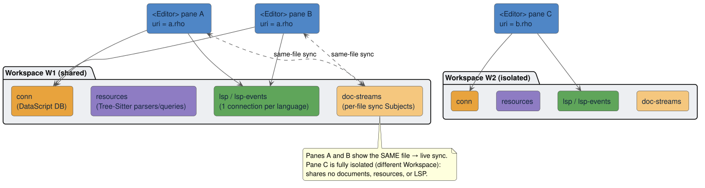

# Multi-Editor Workspaces

A **Workspace** is an instantiable container for everything that used to be a module-level global:
the DataScript connection, the loaded Tree-Sitter resources, the language-server connections, and
the per-file synchronization streams. Multiple `<Editor>` components can **share** one Workspace (and
then collaborate on the same files) or use **isolated** Workspaces (and share nothing). This document
describes the model, the invariants that make it safe, and the reactive same-file synchronization
that split panes rely on.

## Why Workspaces exist

Before this design, the editor kept its state in module-global `defonce` atoms: a single DataScript
`conn`, a global resource registry (Tree-Sitter parsers + LSP sockets), and per-URI global scratch
for pending syncs. That made two things impossible: (1) running two genuinely independent editors on
one page, and (2) having two panes collaborate on one file. It also coupled every `lib.db` function
to a hidden global.

The redesign **eliminated the module-global singletons** in favour of an instantiable `Workspace`,
and **threaded the `conn` explicitly** as the first argument through every `lib.db` function. The
full campaign is recorded in
[`../archive/remediation/MULTI_EDITOR_WORKSPACE_LEDGER.md`](../archive/remediation/MULTI_EDITOR_WORKSPACE_LEDGER.md);
what follows is the resulting design.

## The `Workspace` record

`lib.workspace` (`src/lib/workspace.cljs`) defines:

```clojure
(defrecord Workspace [conn resources doc-streams lsp lsp-events])
```

| Field | What it owns |
|-------|--------------|
| `:conn` | The DataScript connection — documents, diagnostics, symbols, logs, projects (see [data-model.md](data-model.md)). |
| `:resources` | An atom `{:lsp {} :tree-sitter {}}`: loaded grammars/parsers and LSP connect-deduplication bookkeeping. |
| `:doc-streams` | An atom `{uri → {:subject Subject :seq int :ref-count int}}` — the per-file change channels used for same-file sync. |
| `:lsp` | An atom holding **one LSP connection per language** for this Workspace, shared by all its panes. It also carries a back-reference to `:resources` under `:res-atom` so the LSP client can reach the right per-Workspace socket store from inside asynchronous WebSocket callbacks. |
| `:lsp-events` | An RxJS `Subject` onto which the single connection emits inbound server events; every pane subscribes and forwards to its own event stream. |

Constructors and resolution:

- `make-workspace` builds a fresh, isolated instance.
- `ensure-workspace` is the single resolution point (prop → context → default).
- `reset-workspace!` clears an instance (used by tests).

### The hot-reload survival invariant

There is exactly **one** module-level cell left in the whole design — the shared *default*
Workspace:

```clojure
(defonce default-workspace (delay (make-workspace)))
```

`defonce` + `delay` means the default Workspace (and therefore its `conn`) is created **once** and
survives React re-renders *and* development hot-reloads (`:dev/after-load`), exactly like the old
`(defonce conn …)` did. An `<Editor>` with no `workspace` prop resolves to this *shared* default
(never a fresh per-instance fallback), so its open documents survive a hot reload. **Any redesign
must preserve this property** — it is the reason single-editor behaviour is unchanged by the whole
multi-editor refactor, and it is verified by the entire pre-existing test suite passing over the
default Workspace.

## Associating editors with Workspaces

There are three ways to attach an `<Editor>` to a Workspace:

1. **The `workspace` prop** — pass a `createWorkspace()` handle directly.
2. **`<EditorWorkspaceProvider value={ws}>`** — share one Workspace via React context with all
   descendant editors that do not specify their own.
3. **Omit both** — resolve to the shared default Workspace.



Two editors given the **same** Workspace share documents, loaded grammars, and one LSP connection per
language; given **distinct** Workspaces they share nothing.

## Per-pane active document vs. Workspace focus

A subtle but important distinction:

- Each editor's **state atom** owns which file *that pane* shows, under `:active-uri`. This is the
  cheap, per-pane value the keystroke listener reads (it does **not** issue a DataScript query per
  keystroke to learn the active URI — a hot-path win; see the
  [performance model](../benchmarks/performance-model.md)).
- The Workspace `conn` retains `:workspace/active-uri` as the single Workspace **focus** (what the
  demo app's file tree highlights). `activate-document` sets *both*.

On unmount, a pane clears the Workspace focus only if *it* currently held it — a blanket retract
would blank a sibling pane's focus.

## Same-file reactive synchronization

When two or more panes in one Workspace show the **same** file, their edits propagate live between
them (Google-Docs-style), while each pane keeps its own cursor, selection, and scroll. The mechanism
is `lib.workspace.doc-sync` (`src/lib/workspace/doc_sync.cljs`).


### Transport and reference counting

Each `(Workspace, uri)` pair has an RxJS `Subject` carrying deltas
`{:origin pane-id :changes <ChangeSet JSON> :uri … :seq n}`, where the producer stamps a monotonic
`:seq`. Streams are **reference-counted**: `get-or-create-stream!` creates the Subject on the first
subscriber and `release-stream!` drops it when the last leaves.

### Zero cost for a lone editor

`has-peers?` gates the producer: if a file has only one viewer, the keystroke path skips
serialization entirely. The common single-editor case therefore pays essentially nothing for a
feature it does not use.

### Double echo-suppression

Convergence without an operational-transform or CRDT engine relies on two guards:

1. **Origin filter.** Each delta carries the origin `pane-id`; a subscriber ignores deltas whose
   origin equals its own `pane-id` (so the author does not re-apply its own edit).
2. **Annotation.** The receiver applies the remote delta annotated with `external-set-annotation`,
   so its *own* CodeMirror update listener treats the change as API-driven — it neither re-publishes
   the delta nor re-runs the "user edited" LSP/DataScript path. The remote delta is applied via
   `ChangeSet.fromJSON`, and the local selection is remapped through the change (`selection.map`), so
   the cursor rebases correctly and the view does not scroll.

### Why this converges

Deltas fan out **synchronously in publish order** to all subscribers, so every pane applies the same
sequence of changes in the same order and reaches the same document state — no conflict resolution is
required. This is the property proven (as safety) by the
[DocSync formal model](../formal/models.md#docsync): subscribed panes converge, and an edit never
echoes back to its origin. (The model abstracts the document as a monotone counter with serialized
edits; it proves convergence and no-echo, not concurrent text merging — see the model's scope notes.)

### Re-subscription is framework-agnostic

When a pane switches files, it must unsubscribe from the old file's stream and subscribe to the new
one. This is driven by a **watch on the state atom's `:active-uri`**, *not* a React effect
dependency — deliberately, because a plain-React host does not re-render on a reagent-atom mutation,
so a React-dependency effect would never fire on a file switch. The watch works under both reagent
and plain-React hosts.

## Per-Workspace resources and LSP

- **Tree-Sitter resources** (grammars, compiled queries, parsers) are cached per Workspace; the
  syntax initializer threads the Workspace's `:resources` atom. Threading the atom explicitly, rather
  than using a dynamic `binding`, is required because the atom must remain reachable from
  asynchronous WebSocket `onmessage`/`onclose` callbacks, which run outside any dynamic scope.
- **LSP** is one connection **per language per Workspace**, shared by all panes. Outbound
  `didChange` is single-producer: edits from any pane on one file accumulate in the Workspace's LSP
  atom and flush as a single, monotonically-versioned `didChange` (debounced per file). Inbound
  server events fan out to **every** pane via `:lsp-events`; each pane applies diagnostics only when
  the event's URI matches the file that pane currently shows. The LSP subsystem is detailed in
  [lsp-subsystem.md](lsp-subsystem.md).

## What replaced each global

| Former global | Replacement |
|---------------|-------------|
| `(defonce conn …)` in `lib.db` | `Workspace :conn`, threaded as the first argument through every `lib.db` function. `lib.db` must **never** require `lib.workspace` (a cycle guard). |
| Global resource registry | `Workspace :resources` (Tree-Sitter + LSP), passed to `lib.state` resource loaders. |
| Per-URI global sync scratch | Per-editor `state-atom` `:pending-idle-syncs` / `:pending-lsp-changes`, and the Workspace LSP atom's per-file `didChange` accumulator. |

Threading `conn` as the first argument is the structural enabler of the whole model: it is what makes
two Workspaces independent. Pure helpers in `lib.db` (validation, transforms) are unchanged.

## The projects model

`lib.db` also models **projects** — a grouping of documents under a root URI:

- Schema: `:project/id` (unique), `:project/root` (unique), `:project/name` (optional), and a
  `:document/project` reference.
- A document auto-links to the project whose `:project/root` is the **longest URI prefix** of the
  document's URI.
- Accessors: `create-projects!`, `project-for-uri`, `documents-by-project`, `project-of-uri`.

See [data-model.md](data-model.md#projects) for the schema detail.

## Related reading

- [editor-component.md](editor-component.md) — how a pane resolves its Workspace and creates its
  `client`.
- [data-model.md](data-model.md) — the per-Workspace DataScript schema and queries.
- [Formal Verification: DocSync](../formal/models.md#docsync) — the safety proof for same-file sync.
- [React Integration](../guide/react-integration.md) — the `createWorkspace`/`EditorWorkspaceProvider`
  API and a split-pane example.
