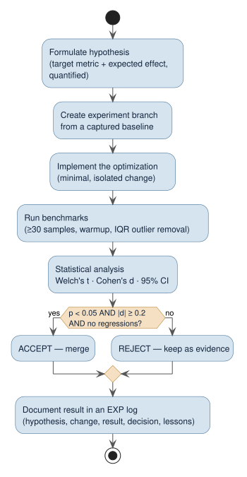

# Experiment-Log Guide

Use this guide when recording a concrete benchmark experiment. An experiment log is a **scientific
record**: it captures a hypothesis, the change, the measured result, and the decision — whether the
optimization was accepted *or* rejected — so that the reasoning and evidence survive. The dated logs
live in the [archive](../archive/README.md#benchmarks--dated-performance-baselines--experiment-records);
this guide is the living template for writing new ones. Do **not** commit unfilled template text —
every committed log must contain real measurements, commands, decisions, and file references.

The workflow this log documents is the [experiment loop](README.md#principles):



## Sections of a log

### Metadata

Record the experiment identifier, ISO date, branch, and final status. Use a specific identifier such
as `EXP-005` and a branch such as `experiment/exp-005-viewport-highlight-cache`.

### Hypothesis

State the performance claim in **measurable** terms: the target benchmark metric and the expected
improvement range (e.g. "`tree-sitter` highlight rebuild on scroll drops from ~300 ms to < 10 ms on a
cache hit"). A hypothesis that cannot be measured cannot be accepted or rejected.

### Background

Describe the current implementation, the observed bottleneck (link profiling data — see the
[performance model](performance-model.md) and the
[bottleneck analysis](../archive/benchmarks/analysis/bottleneck-analysis.md)), and the proposed
change.

### Implementation

List each modified file and the concrete behaviour changed. Include short before/after snippets only
when they clarify the *mechanism* behind the expected effect.

### Verification

Record the **exact commands** used for unit tests, integration tests, type checks, linting, demo
checks, and benchmark runs, with pass/fail status and environment notes (notably whether CPU pinning
was available — see [README.md](README.md#benchmark-environment)). Capture output to a file so a run
is not repeated just to re-read part of its output.

### Benchmark results

Include baseline and experiment tables with the mean, median, `$`P_{95}`$`, and `$`P_{99}`$` for every
target metric, and for each comparison the Welch t-statistic, the p-value, Cohen's `$`d`$`, and the
95 % confidence interval. See [README.md](README.md#statistical-methodology) for the definitions;
`baseline-template.md` gives the table shapes.

### Decision

Apply the rule from [README.md](README.md#decision-rule):

```
ACCEPT  ⟺  p < 0.05  ∧  |d| ≥ 0.2  ∧  no regression in any other metric
REJECT  otherwise
```

A rejected experiment is **still recorded** — a negative result is evidence that stops the dead end
from being re-attempted (see [`EXP-001`](../archive/benchmarks/EXP-001_symbol-get-else.md)).

### Commit information

Reference the concrete commit and summarize the measured result in the commit body: the experiment
identifier, baseline `$`P_{95}`$`, result `$`P_{95}`$`, percentage change, p-value, and decision.

### Lessons

Capture what worked, what did not, and any benchmark or implementation insight that should inform
later work (for example, EXP-010's lesson that a `delay` dereferenced unconditionally is not lazy).

## Related reading

- [README.md](README.md) — the statistical methodology and the running instructions.
- [baseline-template.md](baseline-template.md) — the fill-in baseline structure.
- [performance-model.md](performance-model.md) — the durable results these experiments produced.
