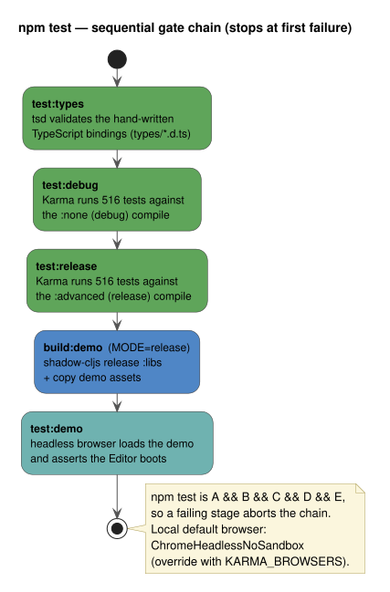
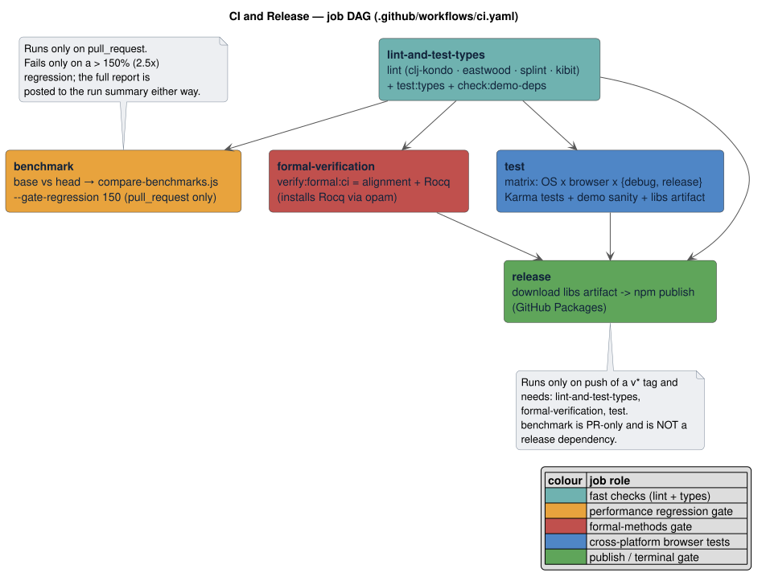

# Building & Testing

This document is the practical reference for building Lightning Bug from source, running its test
tiers, and understanding what the Continuous Integration (CI) pipeline does on every push and pull
request. It reproduces the authoritative script tables from
[`package.json`](../../package.json) and the CI job graph from
[`.github/workflows/ci.yaml`](../../.github/workflows/ci.yaml); if those files disagree with this
document, they win — please open a pull request to correct the drift.

**Acronyms used here.** CI = Continuous Integration; CD = Continuous Delivery; LSP = Language Server
Protocol; WASM = WebAssembly; ESM = ECMAScript Modules; JDK = Java Development Kit; PAT = Personal
Access Token; DAG = Directed Acyclic Graph (a graph of one-way dependency edges with no cycles);
SemVer = Semantic Versioning; `tsd` = the TypeScript-definition test runner; TLC = the Temporal
Logic of Actions (TLA+) model **C**hecker; TLAPS = the TLA+ **P**roof **S**ystem; Rocq = the proof
assistant formerly named Coq. The **release** version this document describes is `0.7.7`.

---

## Prerequisites

Lightning Bug is a ClojureScript project compiled by [shadow-cljs](https://github.com/thheller/shadow-cljs);
the build toolchain runs on both the Java Virtual Machine (JVM) and Node.js.

| Tool | Why it is needed | CI version | Local recommendation |
|------|------------------|------------|----------------------|
| **JDK** (Java) | shadow-cljs and the Clojure linters run on the JVM | Temurin 23 | JDK 21 (LTS) or newer |
| **Clojure CLI** (`clojure` / `clj`) | resolves Clojure deps and runs the linters | latest | latest stable |
| **Node.js** + **npm** | runs shadow-cljs, Karma, `tsd`, and the `scripts/*.js` helpers | latest | Node 20 LTS or newer |
| **PlantUML** + **Graphviz** | render documentation diagrams (`npm run docs:diagrams`) | — | required only when editing diagrams |

Optional, and only for developer-run formal verification (see
[Formal verification in CI](#formal-verification-in-ci) and the
[verification gate](../formal/verification-gate.md)): the TLA+ tools (TLC), TLAPS, and Rocq
(installed via opam). CI installs Rocq itself; it does **not** run TLC or TLAPS.

---

## Install

```bash
# 1. Node dependencies. One dependency (@f1r3fly-io/tree-sitter-rholang-js-with-comments)
#    is hosted on GitHub Packages, so a GitHub PAT with the `read:packages` scope must be
#    exported first (see the repository README for token setup).
export NODE_AUTH_TOKEN=your_pat_here
npm install

# 2. Clojure dependencies (a dry run that only downloads to the local Maven cache).
clojure -P

# 3. Copy the Tree-Sitter WASM + Rholang grammar/query assets into the app and test trees.
#    There is NO automatic postinstall step, so this must be run explicitly.
npm run prepare:all
```

`prepare:all` is mandatory before the first build or test run: it copies `tree-sitter.wasm` and
`tree-sitter-rholang.wasm` (plus the Rholang query files) out of `node_modules` and into
`resources/public/js/` and the test resource tree. The Karma configuration
([`karma.conf.js`](../../karma.conf.js)) fails fast with an explicit message if these artifacts are
missing, so a "missing test artifacts" error means `npm run prepare:test` (or `prepare:all`) has not
been run.

---

## Build, watch, and release targets

Lightning Bug is a multi-target shadow-cljs project
([`shadow-cljs.edn`](../../shadow-cljs.edn)). The `:libs` target is the shipped product (compiled to
ESM); the others are development, demo, and test harnesses.

| Target | Purpose | Compile | Watch | Release |
|--------|---------|---------|-------|---------|
| `:libs` | Core library + language extensions (the published package) | `npm run build:debug` | `npm run watch:libs` | `npm run build:release` |
| `:app` | Full re-frame development UI (multi-file workspace, logs panel) | `npx shadow-cljs compile app` | `npm run serve:app` | — |
| `:demo` | Minimal standalone `<Editor>` demo (no server) | `npm run build:demo` | `npm run serve:demo` | — |
| `:test` | Browser test harness (interactive, auto-runs) | — | `npm run serve:test` | — |
| `:karma-test-debug` | Headless Karma tests, `:none` (debug) compile | `npm run test:debug` | — | — |
| `:karma-test-release` | Headless Karma tests, `:advanced` (release) compile | `npm run test:release` | — | — |
| `:benchmark` | Performance benchmark harness | `npm run benchmark:build` | `npm run benchmark:serve` | — |

To watch several targets at once, name them together, for example
`npx shadow-cljs watch libs app test` (or the packaged `npm run serve`). The development app is
served at `http://localhost:3000`, the interactive test runner at `http://localhost:8021`, the demo
at `http://localhost:3001`, and the benchmark harness at `http://localhost:3002`.

The `:libs` target compiles to ESM for modern browsers. The release build is minified by the Google
Closure Compiler's `:advanced` optimizations and then post-processed by `scripts/strip-goog.js`
(which removes a stray `goog=goog||{};` statement). Because of Closure compilation plus externalized
dependencies (React, RxJS, CodeMirror, web-tree-sitter are kept as imports), the output is several
ESM files rather than a single bundle; consumers that want one file can add an esbuild/Rollup step
(not included here).

---

## npm scripts reference

Every script below is defined in [`package.json`](../../package.json) and invoked as
`npm run <name>`. They are grouped by role; the command column is verbatim.

### Asset preparation

| Script | Command | Role |
|--------|---------|------|
| `prepare:app` | `node scripts/prepare-app.js` | Copy Tree-Sitter WASM into the app's public resources. |
| `prepare:test` | `node scripts/prepare-test.js` | Copy Tree-Sitter WASM + extensions into the test resources. |
| `prepare:all` | `npm run prepare:app && npm run prepare:test` | Run both of the above. |

### Build

| Script | Command | Role |
|--------|---------|------|
| `build:debug` | `npx shadow-cljs compile libs` | Compile `:libs` in debug (`:none`). |
| `build:release` | `npx shadow-cljs release libs && node scripts/strip-goog.js dist/libs/lib.core.js` | Compile `:libs` in `:advanced`, then strip a Closure artifact. |
| `build:demo` | `node scripts/build-demo.js` | Build the standalone demo (compiles `:libs`, installs demo deps, copies assets). |
| `build` | `npm run build:debug` | Alias for `build:debug`. |

### Watch / serve

| Script | Command | Role |
|--------|---------|------|
| `watch:libs` | `npx shadow-cljs watch libs` | Recompile `:libs` on change. |
| `serve:app` | `npx shadow-cljs watch app` | Watch the development app (`:3000`). |
| `serve:test` | `npx shadow-cljs watch test` | Watch + serve the interactive test runner (`:8021`). |
| `serve:demo` | `npx shadow-cljs watch demo` | Watch the standalone demo (`:3001`). |
| `serve` | `npx shadow-cljs watch libs app test demo` | Watch all four targets at once. |

### Lint

The lint gate is four Clojure linters run in sequence; see
[Contributing → the lint gate](./contributing.md#the-lint-gate) for what each one enforces.

| Script | Command | Role |
|--------|---------|------|
| `lint:clj-kondo` | `clojure -M:dev:clj-kondo` | Static analyzer (unused vars, arity, shadowing). |
| `lint:eastwood` | `clojure -M:dev:eastwood` | Bytecode-level lint (reflection, suspicious constructs). |
| `lint:splint` | `clojure -M:dev:splint` | Idiom / style suggestions. |
| `lint:kibit` | `clojure -X:dev:kibit` | Suggests idiomatic rewrites. |
| `lint` | `npm run lint:clj-kondo && npm run lint:eastwood && npm run lint:splint && npm run lint:kibit` | Run all four. |

### Test

| Script | Command | Role |
|--------|---------|------|
| `test:types` | `tsd` | Validate the hand-written TypeScript bindings in `types/`. |
| `test:debug` | `npx shadow-cljs compile karma-test-debug && cross-env KARMA_FILE=target/karma-test-debug.js npx karma start --single-run` | Headless Karma tests, `:none` compile. |
| `test:release` | `npx shadow-cljs compile karma-test-release && cross-env KARMA_FILE=target/karma-test-release.js npx karma start --single-run` | Headless Karma tests, `:advanced` compile. |
| `test:demo` | `node scripts/test-demo.js` | Boot the built demo in a headless browser and assert the Editor initializes. |
| `test` | `npm run test:types && npm run test:debug && npm run test:release && MODE=release npm run build:demo && npm run test:demo` | The full local gate (see [Running the tests](#running-the-tests)). |

### Formal verification

See [Formal verification in CI](#formal-verification-in-ci) and the
[verification gate](../formal/verification-gate.md).

| Script | Command | Role |
|--------|---------|------|
| `verify:formal:alignment` | `node scripts/verify-formal-alignment.js` | Check that the ClojureScript LSP FSM and the formal models/CI stay in sync. |
| `verify:tla` | `node scripts/verify-tla.js` | Model-check the TLA+ specs with TLC (developer-run). |
| `verify:tlaps` | `node scripts/verify-tlaps.js` | Check the TLA+ proofs with TLAPS (developer-run). |
| `verify:rocq` | `node scripts/verify-rocq.js` | Compile the Rocq proofs under `formal/rocq/`. |
| `verify:formal:ci` | `npm run verify:formal:alignment && npm run verify:rocq` | The subset CI runs and that gates release. |
| `verify:formal` | alignment + TLA + TLAPS + Rocq | The full local suite. |

### Benchmarks

The full methodology lives in the [benchmarks guide](../benchmarks/README.md).

| Script | Command | Role |
|--------|---------|------|
| `benchmark:build` | `npx shadow-cljs compile benchmark` | Compile the `:benchmark` harness. |
| `benchmark:serve` | `npx shadow-cljs watch benchmark` | Interactive benchmark server (`:3002`). |
| `benchmark:run` | `node scripts/run-benchmark.js` | Run the suite headless, output to stdout. |
| `benchmark:baseline` | `node scripts/run-benchmark.js --output docs/benchmarks/results/baseline.json` | Run and save as the baseline. |
| `benchmark:experiment` | `node scripts/run-benchmark.js --output docs/benchmarks/results/experiment.json` | Run and save as the experiment. |
| `benchmark:quick` | `node scripts/run-benchmark.js --quick` | Fewer iterations (fast smoke run). |
| `benchmark:setup` | `./scripts/benchmark-setup.sh --status` | Report CPU governor / frequency status. |
| `benchmark:prepare` | `sudo ./scripts/benchmark-setup.sh --prepare` | Pin CPU to `performance` mode (sudo). |
| `benchmark:restore` | `sudo ./scripts/benchmark-setup.sh --restore` | Restore default CPU settings (sudo). |
| `compare-benchmarks` | `node scripts/compare-benchmarks.js` | Compare two result files (Welch's t-test, Cohen's d). |
| `benchmark:gate` | `node scripts/compare-benchmarks.js … --gate-regression 150` | Fail on a > 150% regression. |

### Documentation & misc

| Script | Command | Role |
|--------|---------|------|
| `check:demo-deps` | `node scripts/check-demo-deps.js` | Fail if a dependency shared by the root and the demo has drifted in version. |
| `docs:diagrams` | `node scripts/render-diagrams.js` | Render every `docs/**/*.puml` to a sibling `.svg` (see [Documentation diagrams](#documentation-diagrams)). |

---

## Node helper scripts

The `scripts/` directory holds the Node.js (and one Bash) helpers that the npm scripts and CI call.
Knowing their roles helps when a build step fails.

| Script | Role |
|--------|------|
| `prepare-app.js` | Copy `tree-sitter.wasm` + the Rholang grammar WASM into `resources/public/`. |
| `prepare-test.js` | Same, into the test resource tree (`resources/public/js/test/…`). |
| `build-demo.js` | Install deps, compile `:libs` (debug or release via the `MODE` env var), install demo deps, copy assets. |
| `strip-goog.js` | Remove the `goog=goog||{};` line the Closure compiler leaves in the release bundle. |
| `install-browser.js` | Install a browser (Chrome/Firefox/Edge/Opera/Brave) for CI, per host OS. |
| `retry.js` | Re-run a flaky command up to three times (wraps Linux runs in `xvfb-run` + `dbus-run-session`). |
| `test-demo.js` | Serve the built demo and drive a headless browser (Puppeteer/Playwright) to sanity-check the Editor. |
| `run-benchmark.js` | Run the benchmark suite in a headless browser and emit JSON results. |
| `compare-benchmarks.js` | Statistically compare baseline vs experiment; supports `--gate-regression`. |
| `benchmark-setup.sh` | Set/restore CPU governor and report frequencies for stable benchmarking. |
| `check-demo-deps.js` | Detect version drift between the root `package.json` and the demo's. |
| `render-diagrams.js` | Render all `docs/**/*.puml` diagrams to SVG (the `docs:diagrams` script). |
| `verify-formal-alignment.js` | Assert the source LSP FSM, the TLA+/Rocq models, and CI reference the same states/models. |
| `verify-rocq.js` | Discover and compile every `formal/rocq/**/*.v` proof. |
| `verify-tla.js` | Model-check the listed TLA+ specifications with TLC. |
| `verify-tlaps.js` | Check the TLA+ proof modules with TLAPS. |
| `karma-playwright-webkit-launcher.js` | A custom Karma launcher for headless WebKit (Safari) via Playwright. |
| `utils.js` | Shared helpers (`runCmd`, `findPkgDir`); not invoked directly. |

---

## Running the tests

The suite is **516 tests**, authored in ClojureScript under `src/test/` and organized by tier:

- **Unit** — `src/test/lib/**` (core library), `src/test/app/**` (the re-frame app),
  `src/test/ext/**` (extensions).
- **Integration** — `src/test/integration/**` (document flow, LSP integration, cross-editor
  coordination).
- **Infrastructure / adapters** — `src/test/infrastructure/**` (the DataScript-backed repositories).
- **Property-based** — for example `src/test/lib/position_property_test.cljs` and property blocks in
  the db/query/LSP tests, using `clojure.test.check` with **fixed seeds** (`{:seed 42}`) so failures
  reproduce deterministically.

The same tests are compiled twice — once under `:none` (`test:debug`) and once under `:advanced`
(`test:release`) — to catch bugs that only surface after Closure `:advanced` renaming/dead-code
elimination.

```bash
# Validate the TypeScript bindings only.
npm run test:types

# Headless Karma, debug (:none) compile.
npm run test:debug

# Headless Karma, release (:advanced) compile.
npm run test:release

# The full local gate: types -> debug -> release -> demo build -> demo sanity.
npm test
```

`npm test` chains five stages with `&&`, so it stops at the first failure. The default local browser
is `ChromeHeadlessNoSandbox` (Chrome headless with `--no-sandbox`); select others by exporting the
`KARMA_BROWSERS` environment variable (for example `KARMA_BROWSERS=FirefoxHeadless`).



For an interactive run, start the browser test harness and open it in any browser — it recompiles and
re-runs on save:

```bash
npm run serve:test
# then open http://localhost:8021
```

---

## Formal verification in CI

Lightning Bug ships TLA+ and Rocq models/proofs of its asynchronous LSP and document-sync logic. CI
runs the **alignment + Rocq** subset (`verify:formal:ci`) and **gates release** on it; the heavier
TLC model-checking (`verify:tla`) and TLAPS proof-checking (`verify:tlaps`) are developer-run
locally because they are slow and toolchain-heavy. The full rationale, the models, and the
source↔model alignment contract are documented in the
[formal verification gate](../formal/verification-gate.md); this section only states where formal
verification sits in the build.

---

## CI pipeline

The workflow [`.github/workflows/ci.yaml`](../../.github/workflows/ci.yaml) ("CI and Release") runs
on pushes to `main`, on `v*` tags, and on pull requests targeting `main`. It is a five-job DAG.



| Job | Trigger / condition | Depends on (`needs`) | What it does |
|-----|---------------------|----------------------|--------------|
| **lint-and-test-types** | every event | — (root) | `npm run lint` (all four linters), `npm run test:types`, and `npm run check:demo-deps`. |
| **benchmark** | `pull_request` only | `lint-and-test-types` | Benchmarks the base branch and the PR head on the same runner, then `compare-benchmarks.js … --gate-regression 150` fails only on a catastrophic (> 150%) regression. The report is posted to the run summary regardless. |
| **formal-verification** | every event | `lint-and-test-types` | Installs Rocq via opam (cached), then runs `npm run verify:formal:ci` (alignment + Rocq). Does **not** run TLC or TLAPS. |
| **test** | every event | `lint-and-test-types` | A matrix over `{ubuntu, windows, macos} × {chrome, firefox, edge, opera, brave} × {debug, release}` (plus Safari/WebKit on macOS): runs the Karma tests, builds the demo, runs the demo sanity test, and (on ubuntu + chrome + release) uploads the `libs-artifact`. |
| **release** | push of a `v*` tag only | `lint-and-test-types`, `formal-verification`, `test` | Downloads the `libs-artifact` and runs `npm publish --access public` to GitHub Packages. |

Note the dependency shape: **release** requires the formal-verification and cross-platform test jobs
(and the lint job) to be green, but does **not** depend on **benchmark** — the benchmark job only
runs on pull requests and is a regression *tripwire*, not a release gate. The regression gate trips
when a metric's mean ratio exceeds $`1 + \frac{150}{100} = 2.5`$ (a 2.5× slowdown), a
deliberately loose threshold because unpinned CI runners are noisy; authoritative performance numbers
come from a manual pinned run (`npm run benchmark:prepare`). See the
[benchmarks guide](../benchmarks/README.md).

---

## Documentation diagrams

All documentation diagrams are authored as [PlantUML](https://plantuml.com/) `.puml` sources under a
section's `diagrams/` folder and committed alongside a **pre-rendered `.svg`**. GitHub does not render
PlantUML source blocks, so the SVG is what actually displays (embedded with a Markdown image link
such as ``). PlantUML is preferred over Mermaid because its output is
byte-reproducible and it can typeset LaTeX in labels.

Rendering requires **PlantUML** and **Graphviz** on your `PATH`. Then:

```bash
npm run docs:diagrams
```

`scripts/render-diagrams.js` walks `docs/**`, renders every `.puml` to a sibling `.svg`
(`-tsvg -nometadata` for reproducible output), and exits non-zero if any expected SVG is missing.

**Workflow when you add or edit a diagram:**

1. Author or edit `docs/<section>/diagrams/<name>.puml`. Start the file with a **bare** `@startuml`
   (no name after it) and put exactly one diagram block per file — the renderer derives the output
   filename from the source filename.
2. Run `npm run docs:diagrams` to (re)generate the sibling `.svg`.
3. Embed it in the Markdown with ``.
4. **Commit both** the `.puml` and the generated `.svg`. Colour elements per the shared
   [colour legend](../README.md#how-this-documentation-is-built) so diagrams stay visually
   consistent across the docs.

Because `.gitignore` blacklists everything by default (see
[Contributing → the .gitignore whitelist gotcha](./contributing.md#the-gitignore-whitelist-gotcha)),
`.puml` and `.svg` files are only committable thanks to the explicit `!/docs/**/*.puml` and
`!/docs/**/*.svg` whitelist entries.

---

## See also

- [Contributing](./contributing.md) — style, commits, tests, and the lint gate.
- [Release process](./release-process.md) — tagging and publishing.
- [Formal verification gate](../formal/verification-gate.md) — what CI verifies and why.
- [Benchmarks](../benchmarks/README.md) — the performance methodology behind the regression gate.
- [Architecture overview](../architecture/README.md) — how the pieces you are building fit together.
