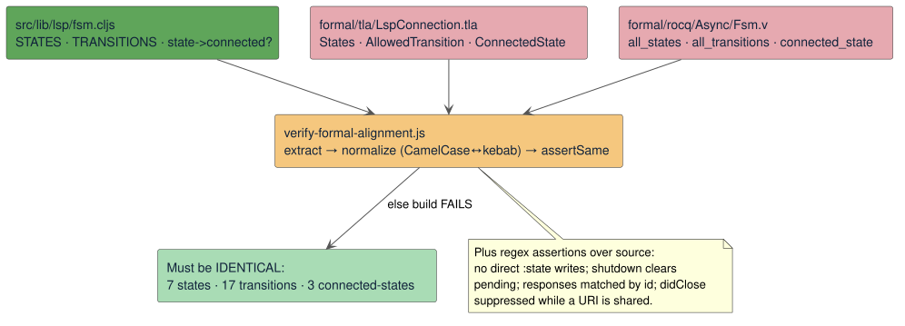

# The Verification Gate

The models and proofs would be inert if nothing connected them to the running code and to
Continuous Integration (CI). This document describes the **verification runners**, the
**source↔formal alignment gate** that keeps the LSP state machine synchronized with the source on
every build, the **CI wiring**, and — most importantly — the **precise, honest statement of what is
and is not guaranteed**.

## The runners

Four Node scripts under `scripts/` drive the tools:

| Script | What it runs |
|--------|--------------|
| `verify-tla.js` | **TLC** over all 11 model specs (base checks invariants; `…InductiveCheck` checks the counterexample-to-induction; `…Liveness` checks the temporal properties). Fails on non-zero exit. |
| `verify-tlaps.js` | **tlapm** over all 8 proof modules, using a local install at `~/.local/tlaps` (with bundled Z3, Zenon, and Isabelle). Errors if `tlapm` is absent. |
| `verify-rocq.js` | **rocq compile** over `formal/rocq`, `Fsm.v` first (dependency order), with logical root `LightningBug`. |
| `verify-formal-alignment.js` | The alignment gate (below) — pure Node, no heavy tools. |

## The alignment gate — `verify-formal-alignment.js`

This is the linchpin: the mechanism that keeps the formal artifacts honest with respect to the code.
It performs four distinct checks.

### 1. File presence

Asserts that all 11 TLA+ `.tla` + `.cfg`, the 8 proof modules, and the 5 Rocq modules exist — so the
formal layer cannot be silently deleted.

### 2. The FSM shape, diffed across three artifacts

The core check parses the **ClojureScript source of truth** `src/lib/lsp/fsm.cljs` — its `STATES`
set, `TRANSITIONS` map, and `state->connected?` set — and the corresponding constructs in
`formal/tla/LspConnection.tla` (`States`, `AllowedTransition`, `ConnectedState`) and
`formal/rocq/Async/Fsm.v` (`all_states`, `all_transitions`, `connected_state`), then requires **all
three to define the identical set of states, the identical transition relation, and the identical
connected-state projection** (normalizing Rocq CamelCase to kebab-case).

This is the concrete answer to "do the models reference source constants that must stay in sync?" —
**yes.** The FSM's state set, transition relation, and connected projection are extracted from all
three artifacts and diffed on every build; **any divergence fails the build.** So the one abstraction
whose faithfulness matters most — the [LspConnection model](models.md#lspconnection) — is provably
kept in lockstep with the code, continuously, not just once.

### 3. Source-behaviour assertions

Beyond the FSM shape, targeted checks assert that specific *code* contains the guarding logic the
models assume:

- **`verifyNoDirectStateWrites`** — no `src/lib/lsp/*.cljs` writes `:state` directly (via
  `assoc-in [:lsp … :state]`); all state changes must go through the validating `transition!`.
- **`verifyLspShutdownAlignment` / `verifyLspRequestResponseAlignment` /
  `verifyLspTransitionGuardAlignment`** — assert the client assigns monotonic ids, records typed
  pending metadata, matches responses by id, clears pending before sending `shutdown`, sends
  `exit` → disconnect → close, and rejects invalid transitions (each mirrored to a named invariant
  such as `PendingKindsMatchPending`, `PendingIdsAreIssued`, `ShutdownPendingIsShutdown`).
- **`verifyDocumentLifecycleAlignment`** — asserts `lib.editor.runtime` flushes `didChange` against
  the **edited** URI (not the active URI at flush time), clears visible diagnostics on local edits,
  and that `lib.editor.commands` suppresses `didClose` and document deletion while a URI is still
  shared with a peer (mirroring `DidCloseOnlyWhenUnshared`).
- **`verifyTlaAsyncPropertyCoverage`** — structural presence checks that every model still contains
  its named invariants/actions/fairness and every proof module still contains its named `THEOREM`s,
  so the models and proofs cannot be silently gutted.

### 4. CI self-guard

`verifyCiDoesNotRunTlaTools` asserts that `.github/workflows/ci.yaml` does **not** install or run
`tlc`/`tlapm`/`tla2tools`/`verify:tla`/`verify:tlaps`, and **does** run `npm run verify:formal:ci`.
The gate literally fails if someone tries to add the heavy TLA+ tools to CI.

## CI wiring

Two npm scripts define the tiers (see [development/building-and-testing.md](../development/building-and-testing.md)):

- **`verify:formal:ci`** = `verify:formal:alignment && verify:rocq` — the **CI gate**.
- **`verify:formal`** = `alignment && tla && tlaps && rocq` — the full **local/manual** gate.

The CI job `formal-verification` sets up Node + Java + Rocq (via a cached opam switch,
`rocq-core` 9.1.0) and runs **only** `verify:formal:ci`. So CI enforces (a) the source↔formal FSM
alignment plus all the behaviour assertions, and (b) Rocq compilation — but deliberately runs
**neither TLC nor TLAPS** (too heavy and tool-dependent for CI). The heavyweight checks are a
developer-run gate. The `release` job depends on `formal-verification`, so a broken alignment or a
broken Rocq proof **blocks publishing**.

| Tool | Runner | In CI? |
|------|--------|:------:|
| Node (alignment) | `verify-formal-alignment.js` | ✅ |
| Rocq (`rocq compile`) | `verify-rocq.js` | ✅ |
| TLC | `verify-tla.js` | ❌ (developer-run) |
| TLAPS (`tlapm` + Z3/Zenon/Isabelle) | `verify-tlaps.js` | ❌ (developer-run) |

## What is (and is not) guaranteed

This is the honest boundary; do not read a stronger claim into the formal layer.

**Guaranteed (mechanically):**

- The LSP FSM's *shape* — its 7 states, 17 transitions, and connected-state projection — is
  **identical** across `fsm.cljs`, `LspConnection.tla`, and `Fsm.v`, and stays so on every build (the
  alignment gate).
- The four abstract state machines satisfy their conjunctive **safety invariants**, verified two ways
  — by TLC on small instances and by TLAPS parametrically for all constants meeting the models'
  `ASSUME`s — and those invariants are **inductive**.
- The modeled **liveness** properties hold under the stated weak-fairness assumptions.
- Rocq independently certifies the core FSM / pending / echo / mount / API-ordering facts,
  constructively.
- The named source behaviours the gate checks (no direct state writes; shutdown clears pending;
  responses matched by id; `didChange` against the edited URI; `didClose` suppressed while shared)
  are present in the code.

**NOT guaranteed:**

- That the ClojureScript **implementation refines the models**. The action semantics are hand-written
  abstractions; the tie to code is (i) the extracted-and-diffed FSM shape and (ii) targeted source
  assertions — a *keep-the-model-honest* gate, **not** a semantic-extraction or refinement proof. See
  [theory.md](theory.md#the-refinement-gap).
- Anything the models abstract away: real CodeMirror internals, real network/timing, DataScript query
  semantics, and concurrent text *merging* (DocSync models a monotone counter with serialized edits).
- Unconditional liveness: the liveness results are contingent on the modeled fair scheduling of
  idealized progress actions.

In short: the gate cannot prove the code is correct, but it makes it very hard for the code and its
specification to drift apart unnoticed — a pragmatic, continuously-enforced form of assurance.

## Related reading

- [theory.md](theory.md) — the refinement gap and why an alignment gate is used instead.
- [models.md](models.md) / [proofs.md](proofs.md) — what the models and proofs actually say.
- [development/building-and-testing.md](../development/building-and-testing.md) — running the gates
  locally and in CI.
- [architecture/lsp-subsystem.md](../architecture/lsp-subsystem.md) — the FSM this gate anchors.
