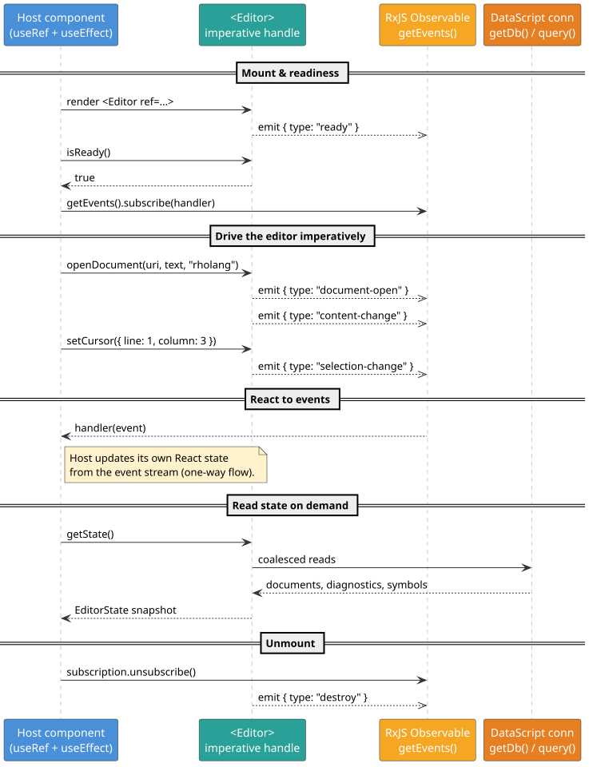

# React Integration

This is the deep guide to driving Lightning Bug from React: the component props, the imperative
handle you reach through a `ref`, the [RxJS](https://rxjs.dev/) event stream, and the multi-editor /
split-pane workflow. It assumes you have installed the package and placed the Tree-Sitter WebAssembly
(**WASM**) assets — if not, start with [Getting Started](./getting-started.md).

Everything here mirrors the authoritative type surface in
[`types/lib.d.ts`](../../types/lib.d.ts). Where this page and the repository's top-level README once
disagreed, the `.d.ts` file wins.

> **Terms used on this page.** **ref** = a React reference to the mounted component's imperative
> handle. **RxJS** = Reactive Extensions for JavaScript, the library whose `Observable` carries the
> editor's event stream. **LSP** = Language Server Protocol (see
> [LSP Configuration](./lsp-configuration.md)). **URI** = the string that names a document (for
> example `inmemory:///demo.rho`). **DataScript** = the in-memory database that holds editor state
> (see [Querying DataScript](./querying-datascript.md)).

## Importing the component

```js
import { Editor, createWorkspace, EditorWorkspaceProvider } from '@f1r3fly-io/lightning-bug';
import { RholangExtension } from '@f1r3fly-io/lightning-bug/extensions'; // optional Rholang support
```

`Editor` is a
[`React.forwardRef`](https://react.dev/reference/react/forwardRef) component: it accepts the props
described below and exposes an imperative handle (the `EditorRef`) through a `ref`.

## Component props (`EditorProps`)

Every prop is optional. The full set, exactly as declared in `types/lib.d.ts`:

| Prop | Type | Purpose |
|------|------|---------|
| `treeSitterWasm` | `string \| (() => string)` | URL (or a thunk returning one) for the **core** Tree-Sitter runtime WASM. Defaults to `"js/tree-sitter.wasm"`. |
| `languages` | `Record<string, LanguageConfig>` | Map of language key → configuration. Merged over the built-in `"text"` language. See [Language Extensions](./language-extensions.md). |
| `extraExtensions` | `Extension[]` | Additional [CodeMirror 6](https://codemirror.net/) extensions (keymaps, themes, plugins) appended to the default stack. |
| `defaultProtocol` | `string` | Protocol used to expand bare file paths into URIs. Defaults to `"inmemory://"`, so `demo.rho` becomes `inmemory:///demo.rho`. |
| `onContentChange` | `(text: string) => void` | Convenience callback fired with the active document's full text when it changes. Equivalent to subscribing to the `content-change` event and reading the text. |
| `workspace` | `Workspace` | A shared workspace handle from `createWorkspace()`. Omit to use the process-default workspace. See [Multi-editor Workspaces](#multi-editor-and-split-pane-workflows). |
| `uri` | `string` | The document this pane should show. Primarily for split-pane / multi-file setups where several editors share one `workspace`. |

A "thunk" (a zero-argument function) is accepted anywhere a path/URL is, so you can defer or compute
the value lazily — see
[dynamic resolution](./language-extensions.md#dynamic-resolution-thunks-and-data-urls).

Minimal usage:

```jsx
import React, { useRef } from 'react';
import { Editor } from '@f1r3fly-io/lightning-bug';
import { RholangExtension } from '@f1r3fly-io/lightning-bug/extensions';

function MyEditor() {
  const editorRef = useRef(null);
  return (
    <div className="code-editor" style={{ height: '400px' }}>
      <Editor
        ref={editorRef}
        languages={{ rholang: RholangExtension }}
        defaultProtocol="inmemory://"
        onContentChange={(text) => console.log('length:', text.length)}
      />
    </div>
  );
}
```

The editor fills its parent element, so give the wrapper (here `.code-editor`) an explicit size. See
[Styling](./styling.md).

## The imperative handle (`EditorRef`)

Attach a `ref` and, once the editor is ready, call methods on `ref.current`. **All positions are
1-based**: `{ line: 1, column: 1 }` is the first character. The methods are grouped below by concern;
each returns `void` unless a return type is shown.

### Readiness

- **`isReady(): boolean`** — `true` once the editor is initialized and its methods are safe to call.
  Prefer waiting for the `ready` event (see [subscribing to events](#subscribing-to-events)) or poll
  `isReady()` as the [Getting Started](./getting-started.md#your-first-editor) example does.

### Document lifecycle

- **`openDocument(fileOrUri, text?, lang?, makeActive?)`** — open or activate a document. Reuses an
  existing document with the same URI; updates its text/language if you pass them. Notifies the LSP
  server if one is connected. Pass `makeActive = false` to open in the background without switching
  to it. Emits `document-open`.
- **`activateDocument(fileOrUri)`** — make an existing document the active one (loading it into the
  view), or open it in LSP if it is not yet. Emits `document-open`.
- **`closeDocument(fileOrUri?)`** — close the named (or active) document. Emits `document-close`.
- **`renameDocument(newFileOrUri, oldFileOrUri?)`** — change a document's URI. Emits
  `document-rename` with `{ oldUri, newUri }`.
- **`saveDocument(fileOrUri?)`** — mark the document saved and notify LSP via `didSave`. Emits
  `document-save`.

### Cursor and selection

- **`getCursor(): Position`** / **`setCursor(pos)`** — read or move the caret in the active document.
  `setCursor` emits `selection-change`.
- **`getSelection(): Selection | null`** / **`setSelection(from, to)`** — read or set the selected
  range. `getSelection` returns `null` when nothing is selected; `setSelection` emits
  `selection-change`. A `Selection` is `{ from: Position, to: Position, text: string }`.

### Text and identity

- **`getText(fileOrUri?): string | null`** / **`setText(text, fileOrUri?)`** — read or replace a
  document's entire text (defaults to the active document). `setText` emits `content-change`.
- **`getFilePath(fileOrUri?): string | null`** — the file path form, for example `"/demo.rho"`.
- **`getFileUri(fileOrUri?): string | null`** — the full URI form, for example
  `"inmemory:///demo.rho"`.

### Highlight and scroll

- **`highlightRange(from, to)`** / **`clearHighlight()`** — set or clear a highlighted range. Both
  emit `highlight-change` (with the range, or `null`). **See the important caveat below.**
- **`centerOnRange(from, to)`** — scroll so the range is centered in the viewport. Emits `scroll`.

> **Highlight rendering caveat (read this).** `highlightRange` / `clearHighlight` update the editor's
> internal highlight state and always emit the `highlight-change` event, **but the CodeMirror plugin
> that paints the `.cm-highlight` background decoration is *not* part of the default extension
> stack.** The default stack is line numbers, bracket matching, close-brackets, the standard keymaps,
> the Tree-Sitter syntax compartment, a dark theme, the diagnostics field, the update listener,
> undo/redo history, and the search panel — no range-highlight plugin. Consequently, calling
> `highlightRange` will fire the event but show **no visible highlight** unless you supply a
> decoration yourself. Two supported approaches:
>
> 1. **Render your own decoration** by subscribing to `highlight-change` and drawing a CodeMirror
>    decoration (or any overlay) from the emitted `{ from, to }` range. This is the portable path for
>    JavaScript/TypeScript consumers.
> 2. **Provide a range-highlight extension** through `extraExtensions` that reacts to the same range.
>
> The `centerOnRange` scroll behavior has no such caveat — it works out of the box.

### Search

- **`getSearchTerm(): string`** — the current search term (also broadcast via `search-term-change`).
- **`openSearchPanel()`** — open CodeMirror's search panel (the search extension *is* in the default
  stack).

### LSP methods

These read language-server results and manage the connection; see
[LSP Configuration](./lsp-configuration.md) for the full picture.

- **`getDiagnostics(fileOrUri?): Diagnostic[]`** — diagnostics for the named (or active) document.
- **`getSymbols(fileOrUri?): Symbol[]`** — document symbols for the named (or active) document.
- **`shutdownLsp(lang?)`** — shut down the LSP connection for one language, or all languages if
  omitted.

`Diagnostic` and `Symbol` positions are **0-based** (they mirror the LSP wire format): a diagnostic
carries `startLine`, `startChar`, `endLine`, `endChar`, a numeric `severity` (1 = Error, 2 = Warning,
3 = Info, 4 = Hint), and a `message`.

### DataScript methods

These read the editor's internal database; see [Querying DataScript](./querying-datascript.md) for
the query language and schema.

- **`query(query, params?): any`** — run a Datalog query against the active workspace's DataScript
  database and get a JavaScript array back.
- **`getDb(): any`** — the raw DataScript connection, for advanced use with the `datascript` library
  directly. `query`/`getDb` and their results are intentionally typed `any` because Datalog result
  shapes are dynamic.

### State and events

- **`getState(): EditorState`** — a snapshot: `{ workspace, cursor, selection, logs, diagnostics,
  symbols, searchTerm }`. Note that `getState().workspace` is a **`WorkspaceSnapshot`**
  (`{ documents, activeUri }`), which is different from the opaque `Workspace` handle returned by
  `createWorkspace()`. See [TypeScript Bindings](./typescript-bindings.md#workspace-vs-workspacesnapshot).
- **`getEvents(): Observable<EditorEvent>`** — the RxJS event stream (below).

### Logging

- **`getLogLevel(): LogLevel`** / **`setLogLevel(level)`** — read or set the
  [Timbre](https://github.com/taoensso/timbre) log level. `LogLevel` is one of `'trace' | 'debug' |
  'info' | 'warn' | 'error' | 'fatal' | 'report'`.

The following sequence diagram shows the typical ref-plus-events interaction over a component's
lifetime. Blue = your host component, teal = the editor handle, amber = the RxJS stream, orange =
DataScript.



## Subscribing to events

`getEvents()` returns an RxJS `Observable<EditorEvent>`. Subscribe to react to internal activity and
LSP notifications; drive your own React state one-way from the stream. Always unsubscribe on unmount.

```jsx
import React, { useRef, useEffect } from 'react';
import { Editor } from '@f1r3fly-io/lightning-bug';
import { RholangExtension } from '@f1r3fly-io/lightning-bug/extensions';

function EditorWithEvents() {
  const editorRef = useRef(null);

  useEffect(() => {
    let subscription;
    const id = setInterval(() => {
      const ed = editorRef.current;
      if (ed && ed.isReady()) {
        clearInterval(id);
        subscription = ed.getEvents().subscribe((event) => {
          switch (event.type) {
            case 'content-change':
              console.log('content of', event.data.uri, 'changed');
              break;
            case 'diagnostics':
              console.log('diagnostics:', event.data.length);
              break;
            default:
              console.log(event.type, event.data);
          }
        });
        ed.openDocument('demo.rho', 'new x in { x!("Hello") | Nil }', 'rholang');
      }
    }, 50);
    return () => {
      clearInterval(id);
      if (subscription) subscription.unsubscribe();
    };
  }, []);

  return (
    <div className="code-editor" style={{ height: '400px' }}>
      <Editor ref={editorRef} languages={{ rholang: RholangExtension }} />
    </div>
  );
}
```

Because `ready` fires once at initialization, an alternative to polling `isReady()` is to subscribe
first and start your work inside the `ready` handler. Since `getEvents()` is backed by a
`ReplaySubject`, a late subscriber still receives the buffered `ready` event.

### The event catalog (`EditorEvent`)

Each event is `{ type, data }`. The complete union from `types/lib.d.ts`:

| `type` | `data` shape | When |
|--------|--------------|------|
| `ready` | `{}` | Editor initialized and ready for imperative calls. |
| `content-change` | `{ content: string, uri: string }` | A document's text changed. |
| `selection-change` | `{ cursor: {line, column}, selection: {from, to, text} \| null, uri }` | Caret or selection moved. |
| `document-open` | `{ uri, content, language, activated }` | A document was opened (or activated). |
| `document-close` | `{ uri }` | A document was closed. |
| `document-rename` | `{ oldUri, newUri }` | A document's URI changed. |
| `document-save` | `{ uri, content }` | A document was saved. |
| `lsp-message` | `{ method, lang, params? }` | A raw LSP message was exchanged. |
| `lsp-initialized` | `{ lang }` | The LSP connection for a language finished initializing. |
| `diagnostics` | `Array<{ uri, version?, message, severity, startLine, startChar, endLine, endChar }>` | Diagnostics were updated. |
| `symbols` | `Array<{ uri, name, kind, startLine, startChar, endLine, endChar, selection*Line, selection*Char, parent? }>` | Document symbols were updated. |
| `log` | `{ message, lang }` | A log line (often from LSP). |
| `connect` | `{ lang }` | LSP transport connected. |
| `disconnect` | `{ lang }` | LSP transport disconnected. |
| `lsp-error` | `{ message, lang }` | An LSP error occurred. |
| `highlight-change` | `{ from: {line, column}, to: {line, column} } \| null` | A highlight range was set or cleared. |
| `language-change` | `{ uri, language }` | A document's language changed. |
| `scroll` | `{ from: {line, column}, to: {line, column} }` | The view scrolled to a range (via `centerOnRange`). |
| `destroy` | `{}` | The editor is tearing down. |
| `error` | `{ message, operation, ... }` | An imperative operation failed (the `operation` names the method). |
| `search-term-change` | `{ term, uri }` | The search term changed. |

Positions inside `selection-change`, `highlight-change`, and `scroll` are **1-based** (the public
API convention); the arrays inside `diagnostics` and `symbols` are **0-based** (the LSP convention).

## Multi-editor and split-pane workflows

A **Workspace** owns a set of open documents, their projects, the loaded Tree-Sitter grammars and
parsers, and the LSP connections. Multiple `<Editor>` instances that share one Workspace share all of
those. This is the foundation for tabs, split views, and multi-file tools.

Create a workspace with **`createWorkspace()`** and hand it to editors either through the
**`workspace`** prop or by wrapping a subtree in **`<EditorWorkspaceProvider value={ws}>`**. Two rules
matter:

- **Hold the handle somewhere stable.** `createWorkspace()` returns an opaque handle. Keep it in a
  module-level binding or a `useRef` so it is not recreated on every render — and so it **survives
  hot reloads** during development. Recreating it would orphan the open documents.
- **An `<Editor>` with no `workspace` prop (and no provider above it) uses a shared, process-default
  workspace.** Several such editors therefore share *that* one workspace's documents.

When two editors share a workspace **and point at the same URI**, they become live-synced panes:
an edit in one propagates to the other immediately (Google-Docs style), while **each pane keeps its
own cursor, selection, and scroll position**. The authoritative persisted text still lives in
DataScript; the live channel is a low-latency delta stream between the views, so a single-editor
document pays essentially nothing for the machinery.

The next diagram traces that flow. Blue = the two `<Editor>` panes, slate = the shared Workspace and
its per-file delta stream, amber = the RxJS delta channel, orange = DataScript (the persisted text).


### Split pane with the `workspace` + `uri` props (JavaScript)

Hold the workspace at module scope so it is stable across renders and hot reloads, then render two
editors that share it and point at the same URI:

```jsx
import React, { useRef, useEffect } from 'react';
import { Editor, createWorkspace } from '@f1r3fly-io/lightning-bug';
import { RholangExtension } from '@f1r3fly-io/lightning-bug/extensions';

// Module-level: one stable handle for the lifetime of the module (survives hot reloads).
const workspace = createWorkspace();
const SHARED_URI = 'inmemory:///split.rho';

export function SplitPane() {
  const leftRef = useRef(null);
  const rightRef = useRef(null);

  useEffect(() => {
    // Seed the shared document exactly once; both panes then show the same URI.
    const id = setInterval(() => {
      const left = leftRef.current;
      if (left && left.isReady()) {
        clearInterval(id);
        left.openDocument(SHARED_URI, 'new x in { x!("Hello") | Nil }', 'rholang');
      }
    }, 50);
    return () => clearInterval(id);
  }, []);

  return (
    <div style={{ display: 'flex', gap: '8px', height: '400px' }}>
      <Editor ref={leftRef}  workspace={workspace} uri={SHARED_URI}
              languages={{ rholang: RholangExtension }} />
      <Editor ref={rightRef} workspace={workspace} uri={SHARED_URI}
              languages={{ rholang: RholangExtension }} />
    </div>
  );
}
```

Because both editors share `workspace`, the document opened through the left pane is immediately
available to the right pane; the `uri` prop tells each pane which of the workspace's documents to
display. Type in either pane and the other updates live, each keeping its own caret. (Editors sharing
a workspace but showing *different* URIs simply display different files from the same document set —
no sync between them, but shared LSP connections and loaded grammars.)

### Split pane with the provider (TypeScript / TSX)

`<EditorWorkspaceProvider>` shares a workspace via React context with every descendant `<Editor>`
that does not set its own `workspace` prop. This is convenient when the editors are not siblings:

```tsx
import * as React from 'react';
import { useRef, useEffect } from 'react';
import {
  Editor,
  createWorkspace,
  EditorWorkspaceProvider,
  type EditorRef,
} from '@f1r3fly-io/lightning-bug';
import { RholangExtension } from '@f1r3fly-io/lightning-bug/extensions';

const workspace = createWorkspace();
const SHARED_URI = 'inmemory:///split.rho';

export function SplitPaneProvided(): React.JSX.Element {
  const leftRef = useRef<EditorRef>(null);

  useEffect(() => {
    const id = window.setInterval(() => {
      const left = leftRef.current;
      if (left && left.isReady()) {
        window.clearInterval(id);
        left.openDocument(SHARED_URI, 'new x in { x!("Hello") | Nil }', 'rholang');
      }
    }, 50);
    return () => window.clearInterval(id);
  }, []);

  return (
    <EditorWorkspaceProvider value={workspace}>
      <div style={{ display: 'flex', gap: 8, height: 400 }}>
        <Editor ref={leftRef} uri={SHARED_URI} languages={{ rholang: RholangExtension }} />
        <Editor uri={SHARED_URI} languages={{ rholang: RholangExtension }} />
      </div>
    </EditorWorkspaceProvider>
  );
}
```

### Sharing vs. isolation, in one table

| Setup | Result |
|-------|--------|
| Multiple `<Editor>`s, **no** `workspace` prop, **no** provider | All share the single process-default workspace. |
| Multiple `<Editor>`s given the **same** `createWorkspace()` handle (prop or provider) | Share one workspace: one document set, one DataScript connection, shared grammars and LSP connections. |
| `<Editor>`s given **distinct** `createWorkspace()` handles | Fully isolated: distinct connections; the same URI is two independent documents. |

These behaviors are exactly what the repository's integration tests assert (see
`src/test/lib/multi_editor_test.cljs` and `src/test/lib/multi_pane_test.cljs`).

## Cleanup

On unmount, unsubscribe from any `getEvents()` subscription. The editor emits a final `destroy` event
as it tears down. If you started LSP connections and want to close them deterministically before
unmount, call `shutdownLsp()`.

## See also

- [Language Extensions](./language-extensions.md) — configure the `languages` prop.
- [LSP Configuration](./lsp-configuration.md) — turn on diagnostics and symbols.
- [Querying DataScript](./querying-datascript.md) — the `query`/`getDb` API.
- [Styling](./styling.md) — the CSS-class catalog and theming.
- [TypeScript Bindings](./typescript-bindings.md) — types for every prop, method, and event.
- Architecture: [the editor component](../architecture/editor-component.md),
  [multi-editor Workspaces](../architecture/multi-editor-workspaces.md), and
  [the event model](../architecture/event-model.md).
